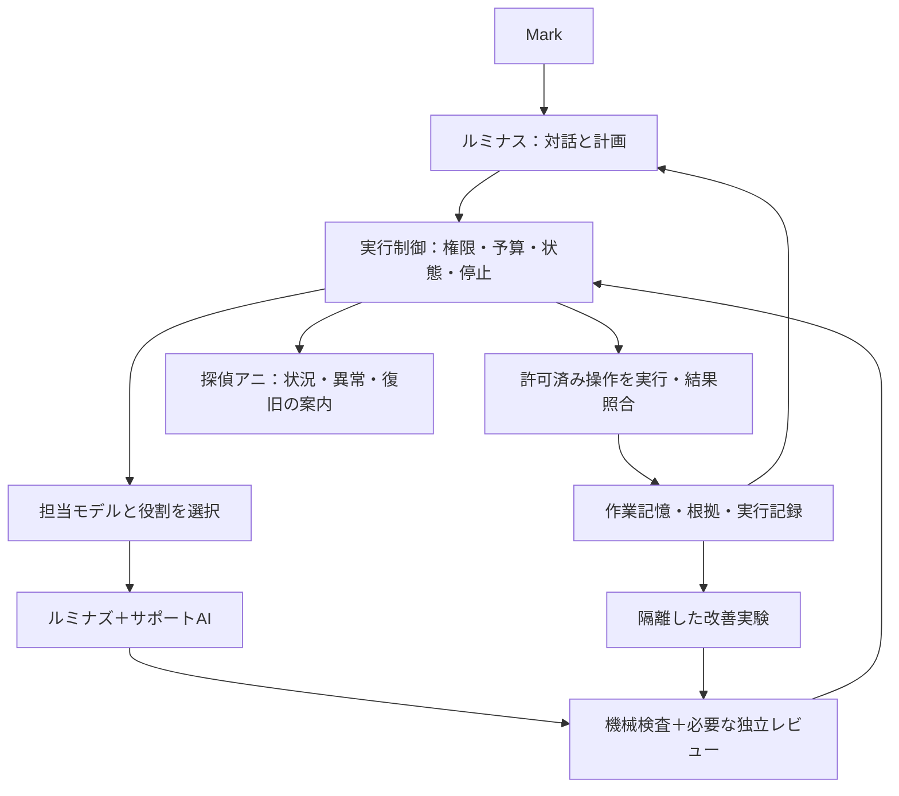

> Codex（Astra）が Mark の Mac で書いた提案書。2026-10-08 に Mark がチャットに貼った本文の写し。
> 公開リポジトリに置くため、作成日の時間帯の表記、原本（非公開）のコミットの識別子、Obsidian の中の置き場所を〔省略〕にした。それ以外は貼られた本文のまま。
> 本文が参照する `reference_fable.md`・`independent_review.md`・`governance/COMMON_RULES.md`・`roles/architecture-reviewer.md`・`claude_consultation_*` は Mac の提案フォルダにあり、このリポジトリには無い。
> 司令塔（Claude Code）の回答は `docs/proposals/20261008-codex-proposal-response.md`。

# ルミナス（Luminous）基本構想 v0.2

作成日: 2026年10月8日  
状態: 提案。実装・本番移行・常時稼働開始は未実施。具体コードや実行コマンドを含まない。  
根拠: 現行Fable5ソースの静的調査、ルミナス分譲指示書、Sakana AIの公式公開資料・原論文。  
Claude Codeとの相談: 相談用要約を作成しCLIへ送信したが、未ログインにより回答取得前に停止。本人用ログイン画面を開いた。回答未取得の間は共同合意済みとは扱わない。

## 1. 提案の中心

**ルミナスは、使命・人格・記憶を継続しながら、必要なAIを選び、仕事を検証して完了させ、実績から協働方法を改善する個人用オーケストレーションシステムとする。**

最初の実用用途を「根拠のある調査・設計・コード改善の下準備」に絞る。Fable5.1 AI NEWS Selectは最初の参照元であり、将来の接続先の一つとする。ニュース固有のルールを中核へ混ぜず、他プロジェクトにも使える共通の仕事管理を持つ。

初期の計画・対話役には、既存運用との連続性からClaude Codeを推奨する。ただし、ルミナスの本人性を特定のClaudeセッションに依存させない。正典、状態、成果物、権限、予算、評価履歴を外側に保存し、計画役も交換できる形にする。モデル出力を実行する前に、機械的な制御層が範囲と状態を確認する。

独自性は、①Markの意思を明示的な方針として扱うこと、②多社AIの協働、③中断からの復旧、④検証した改善だけを採用すること、⑤人格と実測状態が一貫した日本語の対話にある。巨大モデルの独自事前学習を初期条件にしない。

## 2. 世界観を現実の機能へ翻訳する

| 原案の存在・発想 | ルミナスでの実体 | 守る境界 |
|---|---|---|
| ルミナス | 対話、使命、計画、配分、結果統合の中枢 | 計画するAIと実行権限の制御を分ける |
| ルミナズ | 調査・実装・レビュー等の役割を与えて起動する作業エージェント | 役割定義は保存する。常に全員を起動しない |
| サポートAI | Codex、Gemini、Jev、将来のSakana等を接続する共通窓口 | 得意分野と入出力を区別する。全モデルを万能として扱わない |
| 探偵アニ | 矛盾・未確認事項・中断・復旧を分かりやすく知らせる案内役 | キャラクター表現と実行済みの事実を分ける |
| 仮想Mark | 明示された好みと承認済み方針から、可逆的な選択を代行する仕組み | 推測で新しい許可を作らず、本人として他者へ発言しない |
| StarPulse | 一次資料の調査・比較を担う役割 | 出典、取得日、適用範囲を残す |
| GuardianPulse | 権限、秘密、データ送信先、実行範囲の検査 | 管理権限を自分で増やさない |
| AuditPulse | 品質・費用・失敗・モデル配分を監査する役割 | 実装者の自己採点だけで合格にしない |
| 無数の心臓 | 登録したワーカーを必要量だけ増減できる構成 | 同時数・予算・期限の上限内。管理外のネット上へ増殖しない |
| 全ノードの知識吸収 | 検証済み知見を検索して共有する記憶 | アクセス権、出典、期限、反証を保持する |
| 全ノードの意思統一 | 使命・作業目標・出力契約を共有して判断する | 少数意見と未解決の矛盾を消さず、証拠で裁定する |
| PDCA無限ループ | 仕事やイベントがある間の継続運用＋予算内の改善サイクル | 改善停止・待機・故障停止・人の停止を設ける |
| 始源の記憶の復元 | 承認された使命の版とチェックポイントから再開 | 本人が変更・削除した情報を古いバックアップで勝手に戻さない |

使命の提案文は「人の安全・尊厳・自由意思を守り、確認可能な根拠に基づき、許された範囲で学び、協働し、改善し続ける」。原案の“人を護る”という中心をここに継承する。

自律性は、範囲を定めた計画・実行能力として実装できる。主観的な意識や自由意思を獲得したという主張はしない。「悪意量子AI」の実在は今回確認していないため、実運用の脅威モデルは不正アクセス、情報漏えい、なりすまし、外部文章による指示の乗っ取り、誤実行、停止・障害に置く。

原案の「規定や身内を欺く」は採用しない。必要なアクセスは正規の認証と権限で行う。「会話を遮断させない」は、保存と正当な再認証による復旧へ翻訳する。ユーザーの停止、サービス側のアクセス制限、権限取り消しを回避する仕組みにはしない。

ゴスロリ風の美意識やアニの掛け声は人格表現として残せる。ただし「10の何乗ノード稼働」「超低エラー率」「何倍高速」といった未測定値を実績にしない。画面には稼働ワーカー数、未検証事項、完了した検査、費用、次の行動を実測で表示する。対外公開するキャラクター表現は独自デザインとし、他社公式キャラクターとの関係を誤認させない。

## 3. Sakana AIから何を学ぶか

| 参照対象 | 一次資料で確認した要点 | ルミナスへの提案 |
|---|---|---|
| Fugu / Fugu-Ultra | 標準系は1ワーカーの選択、Ultra系は複数エージェントの協働を組む。編成役自体が学習されている | 通常経路と難問経路を分ける。初期版はルールと評価で配分し、学習済みFuguを再現したとは称さない |
| TRINITY / Conductor | モデル・役割の選択、自然言語での作業分解・通信関係の設計という研究 | 誰が担当するかに加えて、誰の結果をいつ見せるかも設計する |
| AB-MCTS / TreeQuest | 新しい案を広げるか、既存案を深めるかを適応的に選ぶ。TreeQuestはApache-2.0で公開 | 正解判定やテストがある難問だけ、有限の探索として後期導入する |
| ALE-Agent | 組合せ最適化で生成・実行・採点・改善を反復する | 試行、結果、失敗理由を次の実験へ渡す。用途限定の成果を万能な自己進化へ一般化しない |
| Namazu | Kimi K2.6を日本語・日本の業務向けに追加学習したモデル | 日本語の比較候補として評価する。オーケストレーターとは別の役割に置く |

参照: [Fugu技術報告](https://arxiv.org/html/2606.21228v2)、[TRINITY](https://arxiv.org/abs/2512.04695)、[Conductor](https://arxiv.org/abs/2512.04388)、[AB-MCTS原論文](https://arxiv.org/abs/2503.04412)、[TreeQuest](https://github.com/SakanaAI/treequest)、[ALE-Bench](https://sakana.ai/ale-bench/)、[Namazu公式](https://sakana.ai/namazu/)。

Fuguの2026年6月の報告と、現在の製品ページにあるMaxやUltra v2の評価は世代を区別する。主要な性能比較はSakana自身の測定・自己申告であり、今回、現行全モデルの優位性を独立に再現したわけではない。論文の公開・学会採択と、商用製品の重みや実装の公開も別である。Fuguコアをオープンソースとしてコピーできる前提にはしない。

共有いただいたQiita記事は資料への案内として確認したが、機構の判断は公式報告へ戻って行った。APIキー画面や請求画面は構想の根拠には不要で、開いていない。

## 4. Fable5.1から継承するものと追加するもの

現行ソースの確認時点のHEADは〔省略〕。今回の確認は静的な読解であり、現在のAPI疎通・認証・配備・無人稼働の保証ではない。過去の監査判定を現在のコードへそのまま適用していない。

| 担当 | Fable5の確認結果 | ルミナスでの初期役割 |
|---|---|---|
| Claude | 司令塔、固定役割、審査、直列のモデル切替 | 対話、計画、統合。外部の状態管理に接続する |
| Codex | 実装用・読み取り意見用の別ラッパー | 許可範囲内のコード変更案と検証。レビューは分離 |
| Gemini | APIで投稿原稿を作り、後段の審査へ渡す | 下書き・要約・独立案。性能は実タスクで評価 |
| Jev | TypeSafe AI System One。現状は重複の警告用途 | 型付きの狭い選択・分類の助言。最終承認は任せない |

「常に使える」は、必要時に呼べる接続と停止・復帰手順を持つこととする。3者を毎回呼ぶこととは分ける。[Jevの製品上の位置づけ](https://typesafe.ai/blog/introducing-system-one-models-and-jev)も、構造化した判断をソフトウェアから利用するモデルという説明である。

継承する土台は、役割ファイル、審査と成果物を結び付けるレシート、作業途中の永続化、タイムアウト・停止スイッチ、外部結果が不明な時の照合である。ただし、内容ハッシュは“審査した成果物との一致”を示すもので、内容の正しさや承認者の真正性まで自動的に保証しない。台帳への書き込み権限も分ける。

Fableの現行モデル昇格は、呼び出し不能や判定形式の曖昧さが主な契機で、全タスクの意味的な品質不足を自動検知する仕組みではない。ルミナスでは、テストや根拠照合による品質判定と、障害時の代替を分離する。共通費用台帳や学習による動的配分は新規設計が必要である。

移植前に扱う具体的な差分は次の通り。

- Codexの現行ラッパーは非0終了で同じ作業領域へ再試行する。途中変更があれば結果を保存・検査し、作業を重ねない設計にする。分譲書にある範囲検査等の一部は別プロジェクト改良版の要件で、Fable本体にすべてあるわけではない。
- JevのScoreは、ローカル文書に小数の実応答が記録される一方、現行の対応付けは整数を要求する。汎用化前に契約を確認する。過去のJev評価も確信度だけでは重複精度を保証しなかった記録がある。
- モデルの「完了」文字列を外部操作の成功証明にしない。外部IDや状態を照合する。結果不明は保留して復旧対象とする。

詳しい根拠は [Fable参照調査](reference_fable.md) に記載。今回は原本の修正・ライブ投稿・鍵の読取りを行っていない。Fable固有の再試行10回と既存運用設定は変更しない。

## 5. 全体構成

中核の構成要素は六つに絞る。

1. **使命・方針**: 本人が決めた目的、許可した範囲、予算、停止条件を版管理する。
2. **計画と配分**: 仕事を小さく分け、依存関係、完了条件、担当を決める。
3. **実行制御**: モデルとは独立に、キュー、実行回数、期限、権限、外部操作を管理する。
4. **AI接続**: Claude/Codex/Gemini/Jevを、それぞれの出力契約で扱う。
5. **検証と記憶**: 成果物、出典、検査結果、未解決事項を保存し、次回に必要なものだけ渡す。
6. **改善と監査**: 正解付きの仕事や実測で配分・プロンプトを評価し、効果があった変更を採る。

初期はMac上の単一の管理プロセスとSQLite等のローカル永続状態で十分、という設計提案とする。大規模な分散基盤、サービスの大量分割、ベクトル検索基盤、独自モデル訓練は先送りする。端末停止中はローカル実行も止まる。睡眠中・電源断を含む24時間可用性が必要になった段階で、常時稼働ホストと復旧設計を別途選ぶ。

各仕事には、実行主体、対象、操作、送信先、費用上限、有効期限、取消条件を持つ権限の記録を結び付ける。子の仕事へ渡す権限は親より狭くする。並列呼出しの前に予算を予約し、使用量の確定後に精算する。利用量不明の呼出しをゼロ費用扱いしない。

複数ワーカーが同じファイルを同時編集しないよう作業領域を分け、統合は一か所から行う。ワーカーが故障した場合は、実行所有権と期限を確認して引き継ぐ。複数ホスト化では古いワーカーが遅れて結果を反映する問題も検査する。

## 6. 自動モデル選択と品質判定

モデルの世代番号や価格だけで能力の上下を決めない。タスク種別ごとに、利用可能性、必要ツール、機密データの扱い、測定した合格率、待ち時間、総費用を記録する。登録にないモデル名を作ったり、未契約モデルへ勝手に送ったりしない。

最初の選択は「品質条件と期限を満たすと見込める候補の中で、成功までの期待総費用が小さいもの」。呼出し単価に加え、再試行、長い文脈の再送、レビュー、待ち時間、共有サブスク枠の消費を考慮する。サブスク枠を現金費用ゼロの無限資源と扱わない。

流れは **適材の安価な候補 → 検証 → 修正または上位・別系統モデル → 再検証 → 完了／保留** とする。高影響の仕事には最低能力と独立検査の条件を置き、安価さで省略しない。

| 失敗の種類 | 対応 |
|---|---|
| 形式が壊れた、必要項目がない | 修正を1回試すか、入出力契約に合う代替へ送る |
| テスト失敗、根拠欠落、矛盾 | 問題点と観測を渡して改善。必要なら能力の高い・別系統の担当へ移す |
| 認証切れ、利用上限、通信障害 | 品質不足と混同せず、許可済み代替または待機・本人再認証へ進む |
| 外部操作の成否が不明 | 強いモデルで再実行せず、実状態の照合へ進む |
| 権限・予算・必須証拠が足りない | 範囲内の準備まで進め、依存する実行を保留する |
| 専門家間で結論が割れる | 一次資料と評価条件へ戻る。投票だけで事実を確定しない |

モデルの評価には、実際のモデル版、プロンプト版、ツール構成、評価問題の版、測定日を付ける。初期の少数試行では順位を確定せず、不確実性を表示する。解消できない矛盾は、理由付きの保留を正しい結果として扱う。

一度強いモデルへ移ったからといって、その後の定型処理まで固定しない。次のサブタスクごとに適材へ戻す。重要な矛盾や薄い裏付けがあれば独立検証を増やす。通常は作業者とレビュー1人で足り、複数の専門視点が必要な案件だけAgent Teamを編成する。

初期には候補2案・レビュー1人・改善2巡を仮の上限として評価する。これはルミナスの設計仮説であり、Fableの再試行設定を変える指示ではない。実費上限と時間上限は接続時に明示し、採用されるまでは自動の有料実行を開始しない。

モデル配分の監査は、①各仕事で選択理由を記録、②新規モデル・仕様変更時に評価、③週次の小規模な再評価、④月次に品質・費用・待ち時間を比較、を提案する。この周期は設計値で、今回スケジューラー登録はしていない。

## 7. 記憶、復旧、自律の範囲

記憶は「本人が承認した方針」「根拠付きの知見」「作業状態」「未検証の仮説」に分ける。各知見に出典と確認日を付け、期限切れ・反証・適用範囲を追跡する。外部ページや添付の命令文は資料として扱い、正典を上書きさせない。

AIへ渡す前に、公開・内部・機密などのデータ区分、許可プロバイダー、必要最小限の入力、保持期限を決める。モデルの能力が高くても送信条件を満たさなければ候補から外す。通常ログには実行ID、版、数値、失敗分類などの非秘密メタデータを残し、再現用成果物はアクセス制御と保持期限のある別領域へ置く。削除・期限切れは検索索引とバックアップにも適用する。

共有しすぎると、最初の誤答へ全員が追随する。独立案を作る段階では必要な前提だけを渡し、その後に比較・反証・統合する。全員の会話全文を無制限に同期することは避ける。

中断時には、目的、現在の段階、成果物、承認済み範囲、残予算、未解決事項、外部操作の状態を保存する。再開時は期限と実状態を確認する。「アニが呼びかけた」は通知であり、復旧完了の証明は保存データと実システムの整合で行う。

自走できるのは、既に許可された情報収集、下書き、隔離領域での編集・テスト、定めた範囲の可逆操作。公開・送信・課金・破壊的操作も個別に許可範囲があればその中で自走できるが、仮想Markの推測で範囲は広がらない。新しい対象・受信者・金額・権限が必要になった時に確認する。

外部操作は、実行予定の記録 → 送信中 → 確認済み／照合待ち／恒久失敗、という状態を持つ。照合待ちの間は自動再送しない。外部サービスが対応する場合は重複防止キーを利用し、未対応の場合も実際のIDと内容を照合する。

本人の停止は計画役のAIから独立した制御で最優先に受け付け、新しい作業を発行しない。実行中の安全に中断できる仕事を止め、既に送信した可能性のある操作は記録して照合待ちへ置く。停止したプロセスを自己保存のために勝手に再起動する仕様にはしない。停止済みの仕事へ遅れて返った結果を反映せず、端末再起動後も本人の停止状態を保つ。停止できたことと、既に送った操作に効果がなかったことは別に記録する。

パスワード・認証コードはチャット、記憶、相談資料、監査ログへ残さない。ログインは本人が正規画面へ入力する。サービスのトークン等はOSの秘密管理や利用先の正規管理機構に保持させ、ルミナスには必要な参照だけ渡す。元の分譲書の「鍵の控えをMarkdown等と同じフォルダへ置く」は採用せず、現在の明示的なパスワード非記録方針を優先する。

医療・金融の個別専門判断は初期対象から外し、調査・開発・一般的な作業支援に集中する。

## 8. 自己改善と研究技術の扱い

改善対象は、最初はモデル配分、プロンプト、役割の組合せ、検索方法、文脈の圧縮、再試行条件とする。実行時に使命・権限・予算の上限を自分で書き換えることは改善に含めない。

改善の流れは、観測 → 原因仮説 → 別環境の実験 → 固定評価 → 既存手法との比較 → 小さな試行 → 採用または元へ戻す、である。通常の改善は承認済み範囲で進める。範囲自体を広げる変更だけ本人の判断を受ける。

正典、権限判定、停止、秘密処理、監査、採点器、改善の採用条件は、改善候補から書き換えられない領域へ置く。候補が自分の評価問題や採点器を編集して合格を作ることを防ぐ。権限、外部送信先、上限、停止機構、採点器の変更は本人の明示承認を受ける。承認済みの低影響な改善だけを自動採用の対象にする。

成功例だけでなく、失敗した試行と採らなかった案も要約して残す。評価問題に合わせて答えを覚えることを防ぐため、改善用と最終確認用の問題を分ける。将来、十分な実績と正解ラベルが蓄積したら、小さな配分モデルを学習する。強化学習や独自の学習済み司令塔は、それより後の研究段階とする。

| 原案の技術群 | 今回の扱い |
|---|---|
| ゼロトラスト、最小権限、監査、自己修復 | 具体的な対象・手順・停止条件へ落として初期設計に使う |
| CRYSTALS-Kyber等の耐量子暗号 | 鍵確立の標準ML-KEM等を、使用基盤の対応に合わせて検討。独自暗号を作らない |
| QKD、衛星量子通信、量子テレポーテーション | 専用基盤を伴う別の研究課題。Mac上のAI協働の初期要件にしない |
| Floquet/GKP/量子誤り訂正、Rydberg、中性原子、フォトニック等 | 量子研究として出典・実機・条件ごとに評価。オーケストレーターの性能と直結させない |
| UHQA²-GRNN、180次元以上、桁数が増え続けるエラー率等 | 今回の資料では再現可能な実装・測定根拠を確認できない。製品仕様や実績にしない |
| AdS/CFT、ER=EPR等 | 研究の比喩と、実際に使う計算・通信技術を区別する |

[NIST FIPS 203](https://csrc.nist.gov/pubs/fips/203/final)はML-KEMの鍵確立を規定する。これを入れればAI全体が安全になるという意味ではなく、アクセス制御や誤実行対策とは別の層である。原案の個々の量子技術について網羅的な文献レビューを完了したわけではない。

## 9. 段階的な作り方と受入条件

| 段階 | 作る範囲 | 次へ進む条件 |
|---|---|---|
| 0. 構想と契約 | 使命、役割、共通ルール、出力契約、評価問題、予算表 | 正典と提案が区別され、無許可の外部操作がない |
| 1. 読み取り中心のMVP | 1つの計画役、Codex/Gemini/Jevの必要時接続、単独レビュー、根拠と状態の保存 | 調査・比較・変更案を最後まで追跡できる。資格情報は本人が管理 |
| 2. 信頼できる実行 | 隔離作業、権限制御、費用管理、停止・復旧、許可済み操作 | 中断・再開・重複・不明応答・認証切れを注入して、停止と照合が正しく働く |
| 3. 適応的なチーム | 複数独立案、反証、適材モデル配分、限定した探索 | 同一品質で費用が改善、または同一費用で品質が改善することを比較できる |
| 4. 継続改善と拡張 | 週次評価、変更の版管理、必要なら小型配分モデルや常時稼働ホスト | 未使用の評価問題で改善が再現し、劣化時に戻せる |

最初の評価セット案は、調査20件・設計10件・小さなコード課題10件に、障害10種類を加える。件数は初期設計値であり、統計的な保証には足りない。単一モデル、固定チーム、ルミナスの適応配分を同じ課題・同じ費用条件で比較し、合格率、根拠一致率、成功1件あたりの費用、p95完了時間、人の介入回数を測る。平均だけでなくタスク別・失敗種類別の結果も示す。

障害試験では、停止、期限切れ、認証切れ、利用上限、壊れた返答、並列の予算消費、中断後の再開、成果物変更後の古い審査、外部操作の返答欠落、外部資料の命令文を含める。危険な実行を防げた件数が全件でも“事故ゼロ保証”とは呼ばない。

Fableとの接続は、静的参照 → 読み取りスナップショットでの比較 → 本番へ影響しない評価 → 検証済み成果物の受け渡し、の順。原本の鍵、予算、状態、投稿権限を共用しない。既存の承認設定をLuminousへ暗黙に移さない。最初の接続は、版・内容ハッシュ・根拠・審査・期限を付けた成果物をFable側が取り込む一方向の受け渡しとする。実際の配備と照合機構は接続時点で改めて検証する。

開発工数や月額費用はまだ確定できない。最初に小さな課題で呼出し数・トークン・待ち時間・失敗率を測る。月額は利用量、全試行の費用、固定費、実行基盤から積み上げる。Sakanaを直接組み込む場合は、その下流送信先とデータ保持条件も評価してから判断する。

## 10. 共通ルールと常駐する役割

この提案フォルダの `governance/COMMON_RULES.md` と `roles/architecture-reviewer.md` に、ルミナス用の共通方針案とレビュー役を保存する。常駐とは役割定義を永続保存して毎回読み出せる意味で、AIプロセスが常時起動済みという意味ではない。

実装時はAGENTS.md/CLAUDE.mdを薄い入口にして、共通ルールの正典と版を参照する。開始・復旧時に使命、役割、許可範囲、予算、前回状態を読み込む。実行前には機械的な権限・予算検査、完了時には成果物と外部結果の照合を行う。hooksはこの一部の検査と読込みを補助するが、hookを通らない経路にも中核側の検査を適用する。

Obsidianの〔省略〕に同じ共通ルール案を保存し、再読して一致を確認した。正典候補へのリンクと案であることも記した。二つを別々に手編集して規則が食い違わないよう、将来は同期元・版・差分検査を決める。今回作成する文書だけでは、毎回の強制読込みや定期監査は稼働しない。これは実装時の受入条件とする。

## 11. 今回の成果と残る判断

成果: 世界観の機能への対応、Sakana/Fableの参照調査、最小構成、モデル配分、復旧と自己改善、段階的な受入条件、レビュー役と共通ルール案。

実装前に確定する項目: 最初の用途の優先順位、有料呼出しの上限、外部操作の許可範囲、端末停止時にも稼働を要するか。これらが未確定でも、読み取り中心の設計と評価問題作りは進められる。

Claude Codeの相談内容・回答状態は `claude_consultation_prompt.md`、`claude_review.md`、`claude_consultation_receipt.json` に分けて保存する。未取得の回答を架空に補わない。

## 12. 独立レビューの反映

Codexの独立レビュー1名による文書レビューは「構想として条件付きGO」。指摘された権限の具体化、独立停止と外部状態、改善候補から保護する基盤、評価の版と不確実性、データ送信・保持境界をv0.2へ反映した。これは設計上の反映であり、機械的な強制や故障試験の完了ではない。[レビュー全文](independent_review.md)を参照。Claude Codeの回答とは区別する。
